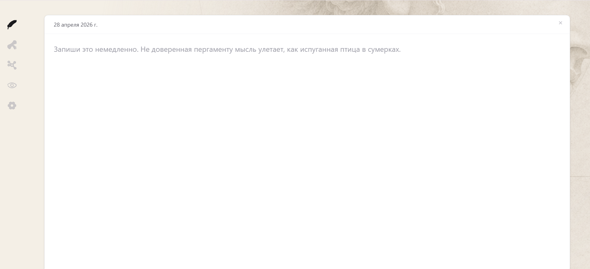
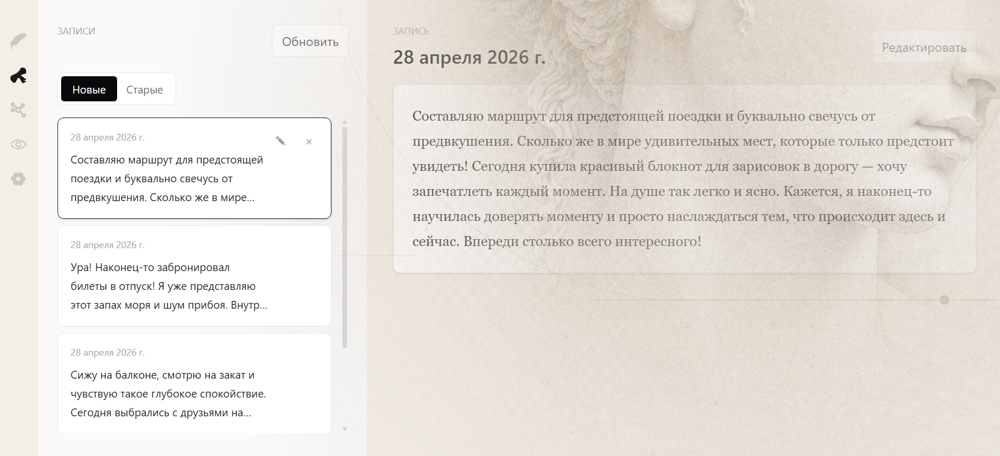

# Athena

Athena is an editor-first daily reflection app with a hidden analytical engine.

The current app is intentionally quiet: the first thing a user gets is a writing surface, not a dashboard, chat, coach, tracker, or analytics console. The analytical layer exists under the surface: it extracts structured signals from entries, stores textless metadata on the backend, computes deterministic recurrence, and shows short observations only when there is enough valid data.

This README describes the project as it currently works in this repository.

## Current Product Shape

Athena currently has five main screens:

- Editor: the primary writing surface. The app autosaves text locally.
- Entries: a list/detail view of local entries merged with backend metadata.
- Graph: a visual mock only. It is not real graph analytics yet.
- Observations: history of generated day/week/month insight snapshots.
- Settings: extraction provider/model, status check, network status, fallback reprocessing, debug mode, persona text toggle, local data clearing.

The current client also has an offline-first app shell. After the first successful online load, the app shell and static assets can be served from the service worker cache. Local writing remains available without network/backend access, while server-backed reads degrade quietly until connectivity returns.

The guiding rule is:

```text
The surface is calm. The engine is strict.
```

## What Athena Is

Athena is currently:

- a local-first daily writing surface;
- a note-first reflection app;
- a hidden signal extraction pipeline over personal writing;
- a deterministic analytics layer over stored signals;
- an observation system that reveals recurrence over time;
- an offline-capable browser app shell after first load;
- a privacy-oriented prototype where the app backend stores no raw diary text.

Athena is currently not:

- a chat product;
- a therapist;
- a coach;
- a task manager;
- a quantified-self dashboard;
- a real graph explorer;
- a mobile app.
- a multi-device sync product.

## How To Run

### Requirements

- Node.js with npm.
- Windows is the most directly supported path right now because the repo includes `.bat` launchers.
- Optional: local Ollama if you want local AI extraction.
- Optional: Gemini API key if you explicitly want cloud extraction.

### Quick Dev Start On Windows

From the project root:

```bat
run-dev.bat
```

This script:

- installs backend dependencies if `node_modules/` is missing;
- installs frontend dependencies if `client/node_modules/` is missing;
- applies SQLite migrations;
- starts the backend at `http://127.0.0.1:3000`;
- starts Vite at `http://127.0.0.1:5173`;
- opens the frontend URL.

Use this mode while editing the frontend. Vite serves the app and proxies API calls to the backend through relative paths.

### Quick Built App Start On Windows

From the project root:

```bat
run-mvp.bat
```

This script:

- installs dependencies if missing;
- applies migrations;
- builds the React frontend;
- starts the backend at `http://127.0.0.1:3000`;
- serves the built frontend from `client/dist` through Express.

Use this when you want the app closer to the packaged MVP flow.

### Manual Dev Start

Install dependencies:

```bash
npm install
npm --prefix client install
```

Create `.env` if needed:

```bash
copy .env.example .env
```

Apply migrations:

```bash
npm run migrate
```

Start backend:

```bash
npm run dev
```

In another terminal, start frontend:

```bash
npm --prefix client run dev -- --host 127.0.0.1
```

Open:

```text
http://127.0.0.1:5173
```

### Manual Built Start

```bash
npm install
npm --prefix client install
npm run migrate
npm run client:build
npm run dev
```

Open:

```text
http://127.0.0.1:3000
```

## Configuration

The app reads `.env` through `server/config/load-env.js`.

The example file is `.env.example`:

```env
ATHENA_AI_PROVIDER=ollama
OLLAMA_BASE_URL=http://localhost:11434
OLLAMA_MODEL=gpt-oss:20b
OLLAMA_REQUEST_TIMEOUT_MS=30000
GEMINI_API_KEY=
GEMINI_MODEL=gemini-2.5-flash-lite
GEMINI_REQUEST_TIMEOUT_MS=30000
ATHENA_HOST=127.0.0.1
```

Supported environment variables currently include:

- `ATHENA_AI_PROVIDER`: `ollama`, `gemini`, or `off`.
- `OLLAMA_BASE_URL`: local Ollama URL. The code only allows local Ollama hostnames.
- `OLLAMA_MODEL`: default Ollama model. Defaults to `gpt-oss:20b`.
- `OLLAMA_REQUEST_TIMEOUT_MS`: Ollama request timeout.
- `GEMINI_API_KEY`: required only for Gemini extraction.
- `GEMINI_MODEL`: default Gemini model. Defaults to `gemini-2.5-flash-lite`.
- `GEMINI_REQUEST_TIMEOUT_MS`: Gemini request timeout.
- `ATHENA_HOST`: backend host. Defaults to `127.0.0.1`.
- `PORT`: backend port. Defaults to `3000`.
- `ATHENA_DATA_DIR`: directory for local runtime data. Defaults to `data/`.
- `ATHENA_DATABASE_PATH`: full SQLite path. Defaults to `data/athena.db`.

## AI Extraction Modes

Athena has three extraction providers:

- `ollama`: local Ollama extraction. This is the default privacy-first mode.
- `gemini`: Gemini API extraction. This requires `GEMINI_API_KEY`.
- `off`: no model extraction. The app uses deterministic fallback signals.

These options are exposed in Settings under `AI extraction`.

Important privacy detail: the backend does not persist raw diary text, but the current extraction endpoint does receive the current entry text transiently in order to call the selected provider. With `ollama`, that provider is intended to be local. With `gemini`, the current entry text is sent to the Gemini API.

## Data And Privacy Model

Athena splits data between browser-local storage and backend SQLite.

### Browser Local Data

Raw diary text is stored locally in the browser using IndexedDB:

```text
athena-private-v1
```

Local entries include:

- raw text;
- local entry date;
- tags extracted from `#tags`;
- source text hash;
- latest known signal metadata;
- sync status.

Settings and UI state are stored in `localStorage`, including:

- debug mode;
- extraction settings;
- entry sort direction;
- online/offline derived UI state;
- persona text toggle;
- seen editor insight IDs;
- insight phrase choice/bag state.

### Backend Data

The backend uses SQLite. By default the database is:

```text
data/athena.db
```

The backend stores:

- textless entry metadata;
- `source_text_hash`;
- tags;
- immutable signal rows;
- signal overrides;
- effective signal view;
- insight snapshots;
- schema/prompt/model metadata.

The backend is designed not to store raw diary text.

There are tests that enforce this boundary, including rejection of raw text in entry API payloads.

## Current Pipeline

The current end-to-end flow is:

```text
user writes locally
-> browser stores raw text in IndexedDB
-> browser hashes raw text
-> extraction runs for the current entry only
-> extraction returns a signal candidate
-> app sanitizes / falls back when needed
-> backend stores textless entry metadata and immutable signal rows
-> analytics read effective signals
-> insight snapshots are generated when sufficiency rules pass
-> UI renders short observations
```

Extraction sees only the current entry. It does not read note history, prior trends, database state, or graph context.

## Offline Behavior

Athena has a small offline-first shell:

- `client/public/sw.js` caches the app shell, `index.html`, and same-origin static assets.
- `client/src/lib/serviceWorker.ts` registers the service worker from the browser client.
- `client/src/lib/offline.ts` tracks `navigator.onLine` and browser `online` / `offline` events.
- Settings shows the current network status.
- Entry and insight list reads return empty arrays on API failure instead of breaking the writing surface.

This is not a full sync engine yet. The app does not currently include a background sync queue, offline API analytics cache, push notifications, or multi-device conflict handling.

## Signals

Signals currently contain:

- `topics`: up to 5 strings;
- `activities`: up to 5 strings;
- `markers`: enum values;
- `load`: integer `0-10` or `null`;
- `fatigue`: integer `0-10` or `null`;
- `focus`: integer `0-10` or `null`;
- `signal_quality`: `valid`, `sparse`, or app-created `fallback`.

Allowed markers currently include:

```text
deadline_pressure
context_switching
deep_work
admin_work
creative_work
late_night_ideas
social_interaction
conflict
uncertainty
health
health_issue
sleep
sleep_issue
exercise
learning
recovery
recovery_need
travel
```

Fallback means the system did not get a usable signal. Fallback values do not pretend to be real measurements.

The active signal schema is currently `signal.v2`, and the active extraction prompt contract is `extraction.v2`.

## Analytics

Analytics are deterministic. They do not call an LLM.

The backend currently computes:

- valid/sparse/fallback counts;
- signal density;
- average load/fatigue/focus from valid signals only;
- topic counts;
- marker distribution with marker-specific priority ordering;
- recurrence;
- daily states;
- entry gaps;
- version boundaries.

The `/analytics/summary` endpoint currently returns week and month summaries based on the latest entry date. This is mostly an internal/debug-style API; the default UI does not show a dashboard.

## Insight Snapshots And Observations

Insight snapshots are persisted in SQLite and shown in the Observations page.

Current sufficiency rules:

- day insight appears if yesterday has at least 1 valid day;
- week insight appears if the last 7 calendar days have at least 4 valid days;
- month insight appears if the last 30 calendar days have at least 14 valid days;
- week snapshots may remain visible for up to 14 days after sufficiency is lost;
- month snapshots may remain visible for up to 45 days after sufficiency is lost.

The server snapshot stores:

- layer: `day`, `week`, or `month`;
- period start/end;
- top topic;
- generated text;
- generated/expiry timestamps;
- schema/prompt version.

The client then formats the visible observation text through phrase libraries.

Observations can also surface first-class context markers, including sparse markers that do not carry numeric state scores.

## Persona Text And Insight Phrase Libraries

There are two distinct insight phrase libraries:

- `client/src/lib/insightPhrases.ts`: ordinary human-readable insight phrases.
- `client/src/lib/athenaInsightPhrases.ts`: Athena-style insight phrases.

The formatter is:

```text
client/src/lib/insightText.ts
```

It:

- extracts the snapshot topic;
- supports legacy text like `тема: health`;
- finds a topic profile by `id` or `aliases`;
- picks a template and advice;
- replaces `{subject}`;
- keeps a stable choice per insight;
- uses phrase bags in `localStorage` to reduce repeated text.

The general Athena placeholder/CTA library is separate:

```text
client/src/lib/athenaPhrases.ts
```

That file is for the editor persona text, not the main insight topic libraries.

## Editor Behavior

The Editor is the primary screen.

Current behavior:

- opens to a blank writing surface;
- autosaves after a short delay;
- includes a local privacy toggle that visually hides or reveals the current text;
- empty input deletes the active local entry and tries to delete its server metadata if it exists;
- `#tags` are extracted locally from the text;
- source text hash is calculated locally;
- new or changed entries are marked `pending_reextract`;
- pending entries are processed during app initialization.

The editor placeholder can use Athena persona text when the persona toggle is enabled.

## Entries Behavior

The Entries page shows local entries merged with backend metadata.

Current behavior:

- list entries newest-first or oldest-first;
- select entry to read details;
- edit an entry by reopening it in the editor;
- delete local entry and attempt to delete server metadata;
- show tags;
- show internal signal details only when debug mode is enabled.

The backend may contain textless metadata that no longer has local text. The client currently treats those as server-only orphan entries and attempts to clean them up during refresh.

## Settings

Settings currently include:

- extraction provider select;
- model select;
- extraction status check;
- network status;
- fallback reprocessing for entries that still have local text;
- debug mode toggle;
- persona text toggle;
- local data clearing.

Debug mode is off by default. When enabled, entry details show internal signal and metadata fields.

## API Surface

Current backend routes:

```text
GET    /config

GET    /extractions/config
GET    /extractions/status
POST   /extractions

GET    /entries
GET    /entries/:id
POST   /entries
PATCH  /entries/:id
DELETE /entries/:id
POST   /entries/:id/signals

GET    /analytics/summary

GET    /insights/current?today=YYYY-MM-DD
GET    /insights
DELETE /insights/:id
```

Express also serves the built frontend from `client/dist` when running the built app on port `3000`.

## Database

Migrations live in:

```text
migrations/
```

Current migration files:

```text
001_init.sql
002_refresh_effective_signals.sql
003_insight_snapshots.sql
004_signal_provider_metadata.sql
005_soft_delete_insight_snapshots.sql
006_insight_snapshot_topic.sql
```

Run migrations with:

```bash
npm run migrate
```

## Project Layout

```text
client/
  React/Vite frontend.

server/
  Express backend, API routes, services, repositories, SQLite access,
  extraction, analytics, insights.

shared/
  Reserved for shared contracts.

migrations/
  SQLite schema migrations.

docs/
  Product notes, invariants, MVP notes, vision.

data/
  Local runtime data. Default SQLite database location.

test/
  Node test suite for backend/data invariants and flows.
```

## Useful Commands

Run tests:

```bash
npm test
```

Build frontend:

```bash
npm run client:build
```

Start backend:

```bash
npm run dev
```

Start frontend dev server:

```bash
npm --prefix client run dev -- --host 127.0.0.1
```

Run frontend lint:

```bash
npm --prefix client run lint
```

## Current Limitations

These are current facts, not future promises:

- Graph is a mock.
- There is no mobile app.
- There is no audio input.
- There is no real semantic note graph yet.
- There is no dashboard UI for analytics.
- Insight text is selected from static phrase libraries, not generated by an LLM at display time.
- Extraction may use an LLM, but only for the current entry.
- The backend does not store raw text, but the extraction endpoint currently receives current-entry text transiently.
- If Gemini is selected, current-entry text is sent to Gemini.
- The default UI hides most engine details unless debug mode is enabled.

## Screenshots

### Editor

### Entries


## Design Direction

Athena should feel:

- quiet;
- precise;
- observant;
- editor-first;
- light on the surface;
- strict underneath.

Avoid turning the default experience into:

- a metrics dashboard;
- a motivational coach;
- a therapy simulator;
- a chat-first app;
- a visible analytics console.

If a future feature conflicts with the editor-first experience, the editor-first experience wins.
