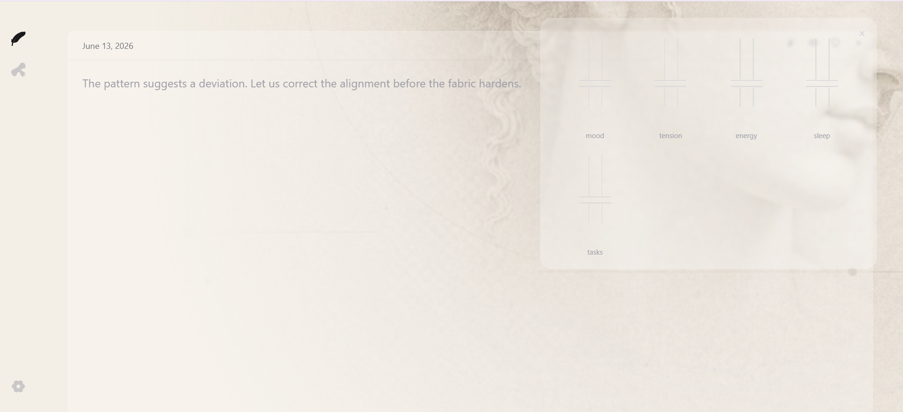
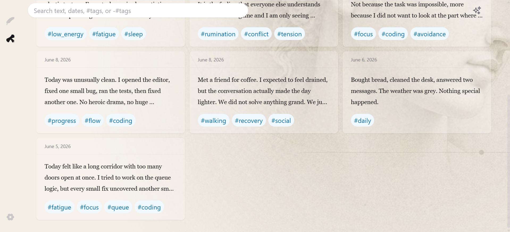

# Athena

<p align="center">
  
</p>

Athena is a local-first daily reflection app with a calm writing surface and a
strict analytical engine underneath.

The product opens as an editor. The user writes, adds tags, and decides which
entries may be analyzed. Athena is not a dashboard, chatbot, coach, productivity
tracker, or medical tool. Its analytical layer stays quiet until there is enough
supported data to show a short observation.

The working principle is:

```text
The surface is calm. The engine is strict.
```

## What Athena Is Today



Athena currently has four visible work surfaces:

- **Editor** - the primary writing surface. It has local autosave, tags, an
  analysis toggle for the current entry, voluntary self-report scales, and a
  quick way to start a new entry.
- **Entries** - the local archive. It supports text, date, and tag search;
  filtering; sorting; reading; editing; deletion; and per-entry analysis
  control.
- **Observations** - saved day, week, and month observations. They are derived
  from deterministic analytics and shown only after sufficiency rules pass.
- **Settings** - interface language, app protection, extraction settings,
  processing queue state, reprocessing controls, debug mode, and local data
  controls.



After the first successful load, Athena also behaves as an offline-capable
browser app shell. The editor and local archive stay useful even when the
backend is temporarily unavailable.

## What Athena Does

- stores raw diary text in the browser;
- encrypts browser-local entries and drafts through the local vault when app
  protection is enabled;
- stores only textless structure on the backend: ids, dates, tags, hashes,
  signals, metadata, self-report aggregates, and insight snapshots;
- extracts signals from the current entry only, without history, RAG, hidden
  memory, or prior trends;
- supports `ollama`, `gemini`, and `off` extraction providers;
- validates and sanitizes Signal v3 payloads before persistence;
- recomputes `load`, `fatigue`, `focus`, confidence, and quality through a
  deterministic mapper;
- keeps a durable browser-local queue for signal reprocessing;
- syncs numeric daily self-report aggregates without raw self-report events;
- shows internal signal details only in debug mode.

Athena is not a diagnostic system and does not replace therapy or medical care.
It is a private diary with a careful analytical layer.

## Privacy Boundary

Raw diary text belongs to the local browser environment.

The backend is not a diary-text store. It keeps the textless data needed for
analytics and observation history: `source_text_hash`, sanitized signals,
effective signals, metadata, daily aggregates, and snapshots.

There is one important boundary: when analysis is enabled, the current entry
text is passed transiently to the selected extraction provider. With `ollama`,
that provider is intended to run locally. With `gemini`, the current entry text
is sent to the Gemini API. With `off`, no model is called and Athena uses the
fallback path.

## Access Model

Athena has two independent access rings:

- **Server auth** - optional protection for the backend API. By default, the
  local API is open for passwordless local use. Set
  `ATHENA_AUTH_REQUIRED=true` to enable owner login with Argon2id password
  hashes, HttpOnly session cookies, hashed session tokens in SQLite, and CSRF
  checks for mutating requests.
- **Local app protection** - optional protection for local diary data. It is
  enabled from Settings and uses the local vault to encrypt entries and drafts
  in IndexedDB. Athena can auto-lock or be locked manually.

## Stack

- React 19, TypeScript, Vite, Tailwind CSS;
- IndexedDB for local entries, draft state, queue state, and vault envelopes;
- Express 4 backend;
- SQLite migrations and repositories;
- Zod schemas for strict API contracts;
- optional browser ONNX emotion spike through `@huggingface/transformers`;
- service worker for app shell caching.

## Run Locally

Install dependencies:

```powershell
npm install
npm --prefix client install
```

Create a local env file:

```powershell
Copy-Item .env.example .env
```

On macOS/Linux:

```bash
cp .env.example .env
```

Run migrations and start the backend:

```powershell
npm run migrate
npm run dev
```

In a second terminal, start the client:

```powershell
npm run client:dev
```

The Vite dev server opens at `http://127.0.0.1:5173` or the next free port. API
requests are proxied to `http://127.0.0.1:3000`.

## Production Build

```powershell
npm run client:build
npm run migrate
npm run dev
```

After `client:build`, Express serves the built client from `client/dist`.

## Release Checks

Basic checks:

```powershell
npm test
npm run server:check
npm run lint
npm run client:build
```

Full release script:

```powershell
npm run release:check
```

`release:check` also runs `npm audit` for both root and client dependencies.

## Data And Artifacts

Local runtime data lives in `data/`. Local documents, `.env`, `node_modules/`,
and `client/dist/` are ignored by Git and should not be part of a release
commit.

README screenshots live in `client/assets/`. The app background image lives in
`client/src/assets/logo-bg.jpg`.
