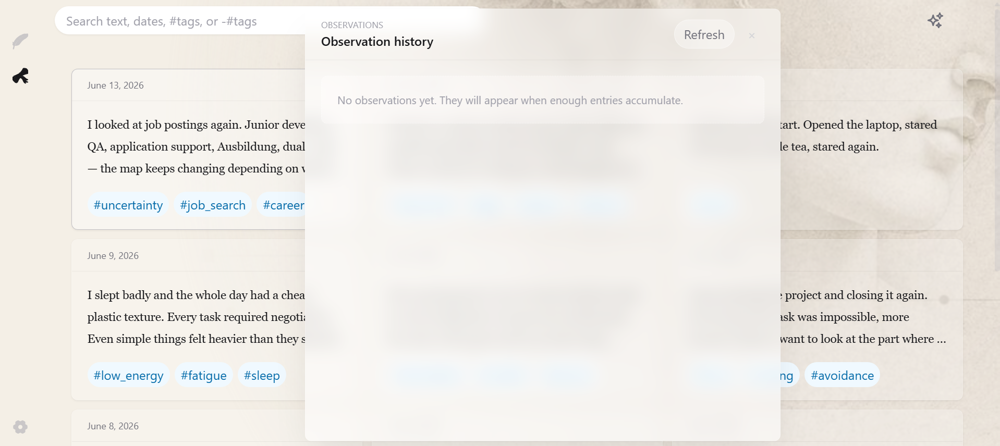
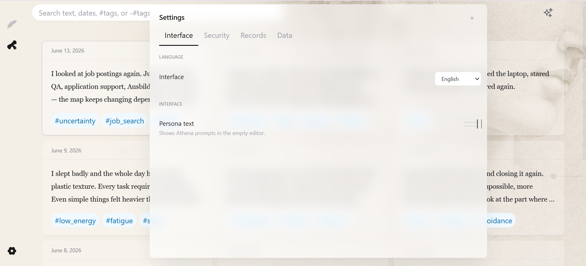

# Athena

Athena is a local-first daily reflection app with a calm writing surface and a
strict analytical engine underneath.

The product opens as an editor. The user writes, adds tags, and decides which
entries may be analyzed. Athena is not a dashboard, chatbot, coach, productivity
tracker, or medical tool. Its analytical layer stays quiet until there is enough
supported data to show a short observation.

The working principle is:

```text
The surface is calm. The engine is strict.
```

## What Athena Is Today


Athena presents a light, paper-like workspace with a narrow icon rail, a
spacious writing surface, and floating panels for secondary views. The UI keeps
the diary surface quiet while making the archive, results, observations, and
settings reachable without turning the diary into a dashboard.

Athena currently has three primary pages:

- **Editor** - the primary writing surface. It has local autosave, tags, an
  analysis toggle for the current entry, voluntary self-report scales in a
  floating panel, and a quick way to start a new entry.
- **Entries** - the local archive. It appears as a searchable card grid and
  supports one hybrid local search across text, dates, tags, and semantic
  similarity; filtering; sorting; reading; editing; deletion; and per-entry
  analysis control.
- **Results** - one unified local list of concrete tasks/projects and repeatable
  activities reconstructed from analyzed entries. Clicking a row expands its
  current status, rhythm, verbal insight, activity graph, and the same source
  entry tiles used in Entries. There are currently no task/activity filters,
  renaming, merging, or manual entry-linking controls.

Two floating panels sit above all three pages:

- **Observations** combines saved day, week, and month observations with current
  activity insights and links back to Results. Snapshot sufficiency is one valid
  day for yesterday, three distinct valid days in the current 7-day window, or
  fourteen valid days in the current 30-day window.
- **Settings** controls interface language, app protection, extraction,
  processing and reprocessing, debug mode, and local data.






After the first successful load, Athena also behaves as an offline-capable
browser app shell. The editor and local archive stay useful even when the
backend is temporarily unavailable.

## What Athena Does

- stores raw diary text in the browser;
- encrypts browser-local entries, drafts, self-reports, and activity-insight
  cache records through the local vault; the vault may use passwordless access
  or passphrase credentials;
- stores only textless structure on the backend: ids, dates, tags, hashes,
  signals, metadata, self-report aggregates, and insight snapshots;
- extracts signals from the current entry only, without history, RAG, hidden
  memory, or prior trends;
- supports `ollama`, `gemini`, and `off` extraction providers;
- validates and sanitizes Signal v5 payloads before persistence;
- extracts bounded activity-specific context for tasks and repeatable practices without storing diary prose;
- builds Results locally from extracted activities and exact, deliberately
  narrow identity rules; a single specific project tag may supply the project
  identity only when the entry also contains task/project evidence, while broad
  or ambiguous tags do not become projects;
- groups only explicit high-confidence aliases such as multilingual job-search
  or German-learning labels; it does not fuzzy-merge similar names;
- generates a deidentified activity-insight batch through Gemini at most once
  per day when enough evidence has changed, and keeps the cache encrypted in the
  local vault;
- recomputes `load`, `fatigue`, `focus`, confidence, and quality through a
  deterministic mapper;
- keeps a durable browser-local queue for signal reprocessing;
- syncs numeric daily self-report aggregates without raw self-report events;
- keeps semantic search and RAG evidence packs browser-local by default;
- shows detailed signal metadata and local self-report values only in debug
  mode.

Athena is not a diagnostic system and does not replace therapy or medical care.
It is a private diary with a careful analytical layer.

## Privacy Boundary

Raw diary text belongs to the local browser environment.

The backend is not a diary-text store. It keeps the textless data needed for
analytics and observation history: `source_text_hash`, sanitized signals,
effective signals, metadata, daily aggregates, and snapshots.

There are two provider boundaries:

- When entry analysis is enabled, that entry's current text is passed
  transiently to the selected extraction provider. With `ollama`, the provider
  is intended to run locally. With `gemini`, the current entry text is sent to
  the Gemini API. With `off`, no model is called and Athena uses the fallback
  path.
- Results insight generation never resends diary prose, activity labels, local
  entry ids, or local activity ids. It sends Gemini a bounded batch of enum-only
  activity context and aggregate counts under temporary correlation ids. The
  returned text is validated before it enters the encrypted browser-local
  cache.

## Access Model

Athena has two independent access rings:

- **Server auth** - optional protection for the backend API. By default, the
  local API is open for passwordless local use. Set
  `ATHENA_AUTH_REQUIRED=true` to enable owner login with Argon2id password
  hashes, HttpOnly session cookies, hashed session tokens in SQLite, and CSRF
  checks for mutating requests.
- **Local vault** - browser-local diary data is encrypted in IndexedDB. The
  default credential may be passwordless; Settings can add passphrases and
  Athena can auto-lock or be locked manually.

## Stack

- React 19, TypeScript, Vite, Tailwind CSS;
- IndexedDB for encrypted local entries, drafts, self-reports, activity
  insights, queue state, and vault envelopes;
- Express 4 backend;
- SQLite migrations and repositories;
- Zod schemas for strict API contracts;
- service worker for app shell caching.

## Documentation

- [Architecture](docs/ARCHITECTURE.md)
- [Code map](docs/CODEMAP.md)
- [Privacy model](docs/PRIVACY.md)
- [API reference](docs/API.md)
- [Contracts and versioning](docs/CONTRACTS.md)
- [Database migrations](docs/MIGRATIONS.md)
- [Testing strategy](docs/TESTING.md)
- [Deployment notes](docs/DEPLOYMENT.md)
- [Self-hosting](docs/SELF_HOSTING.md)
- [Security notes](docs/SECURITY.md)

## Run Locally

Install dependencies:

```powershell
npm install
```

Create a local env file:

```powershell
Copy-Item .env.example .env
```

On macOS/Linux:

```bash
cp .env.example .env
```

Run migrations and start the backend:

```powershell
npm run migrate
npm run dev
```

In a second terminal, start the client:

```powershell
npm run client:dev
```

The Vite dev server opens at `http://127.0.0.1:5173` or the next free port. API
requests are proxied to `http://127.0.0.1:3000`.

## Production Build

```powershell
npm run build
npm run start
```

`npm run start` runs compiled SQLite migrations, then starts the compiled Node server. Express serves the built client from `client/dist`.

## Release Checks

Basic checks:

```powershell
npm test
npm run server:check
npm run lint
npm run client:build
npm run test:e2e
```

Full release script:

```powershell
npm run release:check
```

`release:check` also runs `npm audit` for both root and client dependencies.

## Data And Artifacts

Local runtime data lives in `data/`. Local documents, `.env`, `node_modules/`,
`dist/`, and `client/dist/` are ignored by Git and should not be part of a release
commit.

README screenshots live in `client/assets/`. The app background image lives in
`client/src/assets/logo-bg.jpg`.
